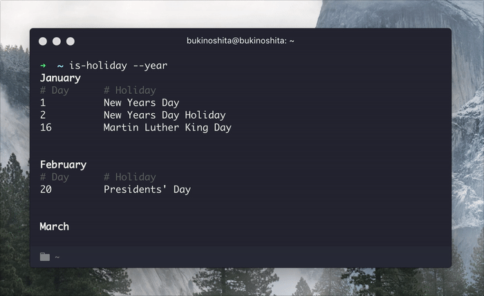

# is-holiday [](https://travis-ci.org/bukinoshita/is-holiday)

> Get todays Federal Public Holidays :confetti_ball:


## Install

```bash
$ npm install -g is-holiday
```


## Usage

```bash
$ is-holiday --help

  Usage:
    $ is-holiday          Check if today is a holiday

  Example:
    $ is-holiday
    $ is-holiday --month
    $ is-holiday --year

  Options:
    -m, --month           Get every holiday for the current month
    -y, --year            Get every holiday for the current year

    -h, --help            Show help options
    -v, --version         Show version
```


## Demo




## Related

- [holiday](https://github.com/bukinoshita/holiday) — :calendar: List of Federal Public Holidays


## License

MIT © [Bu Kinoshita](https://bukinoshita.io)
